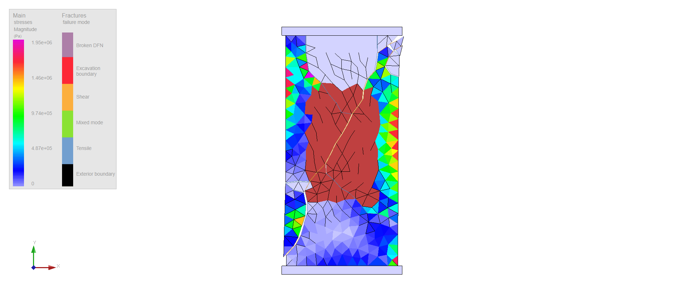
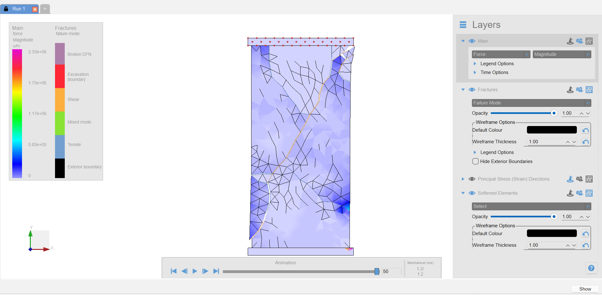
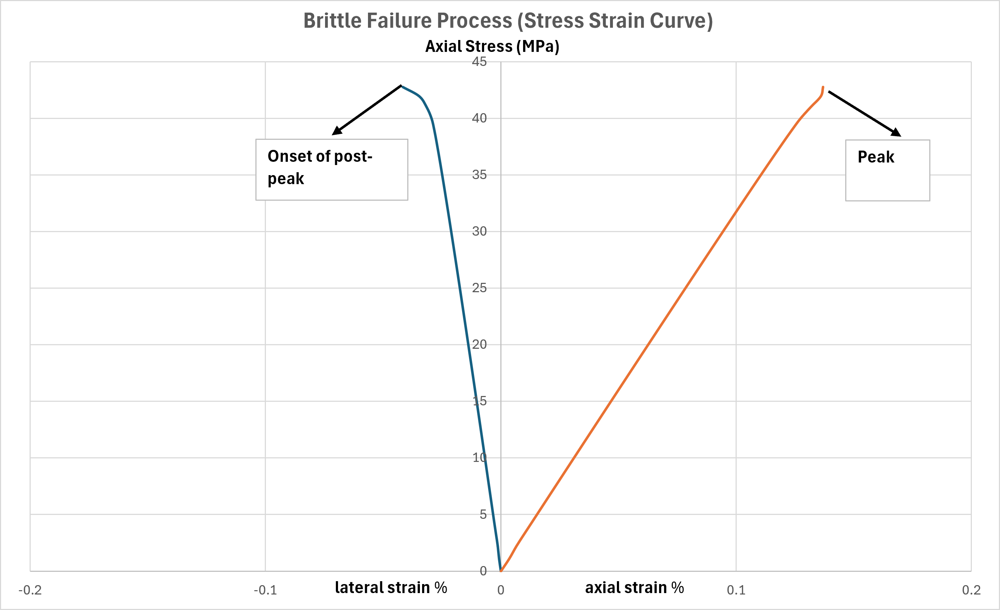
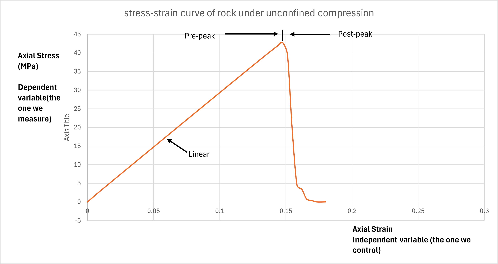

# UCS Brittle Failure Simulation in Irazu

## Overview

This project presents a 2D numerical simulation of brittle rock failure under unconfined compressive strength (UCS) loading using Geomechanica Irazu. The study was completed as part of a numerical modelling assignment on rock fracturing processes and is presented here as a portfolio case study in computational rock mechanics. 

## Project objectives

This UCS case study was structured around the following objectives:

1. Identify the fracture pattern at output step 40, corresponding to about 1.12 ms.
2. Plot stress magnitude over time for an element near the centre of the specimen.
3. Plot the summed nodal force over time for all nodes on the top platen.
4. Generate the stress-strain curve and determine the peak UCS value in MPa.
5. Describe the observed brittle failure pattern.
6. Describe the stress-strain response in terms of brittle rock failure processes. :contentReference[oaicite:1]{index=1}

## Model setup

### Geometry and mesh
- Specimen height: 100 mm
- Specimen width: 50 mm
- Platen thickness: 5 mm
- Platen width: 60 mm
- Mesh size: 5 mm

### Boundary conditions
- Opposite platen velocities applied to top and bottom platens
- Velocity magnitude: 0.075 m/s

### Run settings
- Number of time steps: 100,000
- Output frequency: 2,000

### Material properties

| Property | Platens | Rock |
|---|---:|---:|
| Density (kg/m³) | 8000 | 2200 |
| Damping type | Viscous: Factor | Viscous: Factor |
| Viscous damping factor | 1 | 1 |
| Constitutive law | Plane strain | Plane strain |
| Young’s modulus (Pa) | 2.00E+11 | 3.00E+10 |
| Poisson’s ratio | 0.13 | 0.20 |
| Friction angle (°) | 6 | 35 |
| Fracture model | Isotropic | Isotropic |
| Cohesion (Pa) | 20E+6 | 10E+6 |
| Tensile strength (Pa) | 5E+6 | 2.5E+6 |
| Mode I fracture energy (μN/mm) | 10 | 9400 |
| Mode II fracture energy (μN/mm) | 100 | 94000 |

These geometry, loading, run settings, and material parameters were taken from the Assignment 3 project specification and are also documented in the submitted report. 

## Key result

The model produced localized brittle failure through a dominant inclined fracture band and an estimated peak UCS of approximately **42.77 MPa**. :contentReference[oaicite:3]{index=3}

## Results

### 1. Fracture pattern at output step 40
The specimen developed a dominant inclined damaged zone with several secondary cracks branching around the main failure path, indicating localized brittle failure rather than uniform distributed cracking. :contentReference[oaicite:4]{index=4}

### 2. Stress magnitude over time near the specimen centre
The central element showed a progressive increase in stress magnitude during loading, followed by a sharp stress drop after fracture localization, indicating loss of load-bearing capacity in the specimen interior. :contentReference[oaicite:5]{index=5}

### 3. Top platen force over time
The summed nodal force on the top platen increased steadily during loading, reached a peak near failure, and then dropped sharply during post-peak brittle collapse. The submitted report identifies a peak force magnitude of approximately **2.1 kN** at about **1.0 ms**. :contentReference[oaicite:6]{index=6}

### 4. Stress-strain curve and UCS
The stress-strain response showed a near-linear pre-peak loading stage followed by abrupt post-peak strength loss. The peak unconfined compressive strength obtained from the simulation was approximately **42.77 MPa**. :contentReference[oaicite:7]{index=7}

### 5. Brittle failure process interpretation
The stress-strain interpretation also reflects the typical brittle failure stages in rock, including crack closure, linear-elastic behaviour, crack initiation and propagation, unstable crack growth, and post-peak failure. :contentReference[oaicite:8]{index=8}

## Interpretation

The final fracture pattern shows that failure localized into a dominant inclined band across the specimen, with secondary cracking around the main rupture path. This indicates that the sample progressed beyond early crack initiation and entered a brittle localization regime. :contentReference[oaicite:9]{index=9}

The stress history near the specimen centre and the top platen force history both show the same overall pattern: load increases during compression, then drops sharply once the dominant fracture zone develops. This confirms that failure caused a rapid loss of global and local load-carrying capacity. :contentReference[oaicite:10]{index=10}

The stress-strain curve is consistent with characteristic brittle rock behaviour under uniaxial compression. It reflects initial crack closure, an approximately linear elastic stage, pre-peak damage accumulation, and a sharp post-peak drop associated with unstable crack growth and specimen failure. :contentReference[oaicite:11]{index=11}

## Files in this project

- `figures/` contains the key result images
- `data/` contains processed numerical output data
- `report/` contains the assignment report
- `notes/` contains detailed interpretation notes
- `scripts/` is reserved for post-processing scripts

## Notes

This project is presented as part of my developing portfolio in numerical rock mechanics and computational geomechanics.
