# Direct Shear Test Interpretation

## Overview

This note presents the interpretation of the main post-processing results for the direct shear test simulation carried out in Geomechanica Irazu. The purpose of this note is to explain the mechanical meaning of the plotted responses and the minimum principal stress snapshots obtained from the two simulation runs.

The interpretation is based on:

- shear-load response
- equivalent shear-load response
- instantaneous friction-angle response
- comparison of Run 1 and Run 2
- minimum principal stress evolution at selected simulation times

## File naming convention

The image filenames for the minimum principal stress snapshots follow a clear naming pattern:

- `run1_min_principal_stress_2M_timesteps.png`
- `run1_min_principal_stress_5M_timesteps.png`
- `run1_min_principal_stress_10M_timesteps.png`
- `run1_min_principal_stress_15M_timesteps.png`
- `run1_min_principal_stress_20M_timesteps.png`

and similarly for Run 2:

- `run2_min_principal_stress_2M_timesteps.png`
- `run2_min_principal_stress_5M_timesteps.png`
- `run2_min_principal_stress_10M_timesteps.png`
- `run2_min_principal_stress_15M_timesteps.png`
- `run2_min_principal_stress_20M_timesteps.png`

Here, the labels `2M`, `5M`, `10M`, `15M`, and `20M` mean:

- **2M** = 2 million time steps
- **5M** = 5 million time steps
- **10M** = 10 million time steps
- **15M** = 15 million time steps
- **20M** = 20 million time steps

These images therefore show how the minimum principal stress field evolves as the simulation progresses with increasing time step.

---

## 1. Shear load versus shear displacement

The file `direct_shear_shear_load_vs_displacement.png` shows the direct relationship between shear resistance and imposed shear displacement for both simulation runs.

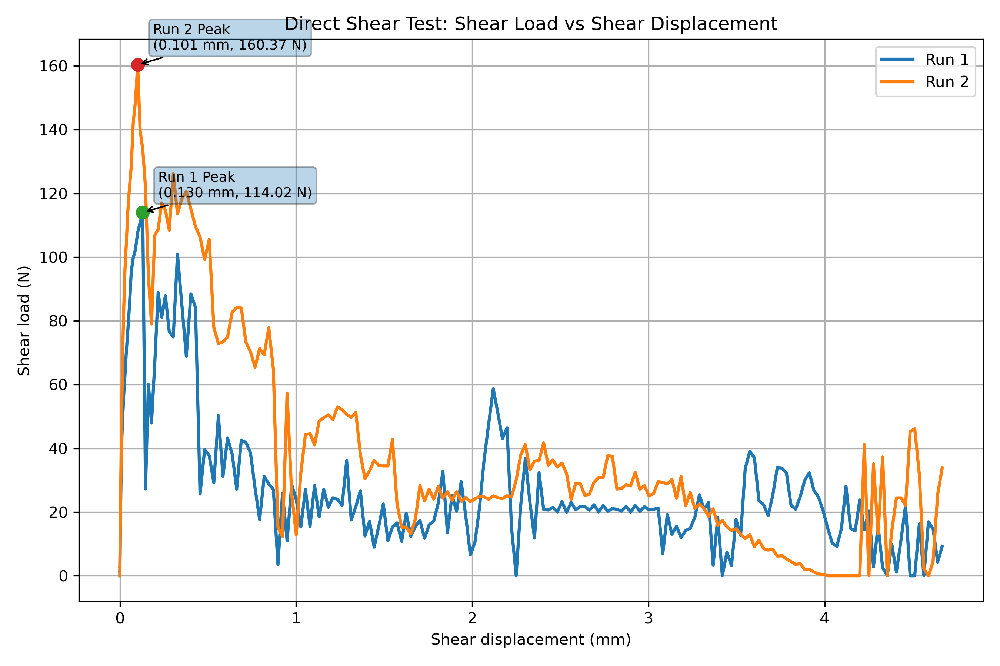

### Interpretation

Both runs show a rapid increase in shear load at the early stage of shearing, followed by a distinct peak and then a post-peak reduction. This is the expected behavior for a rough discontinuity under direct shear.

- **Run 1** reaches a peak shear load of about **114.02 N** at a displacement of about **0.130 mm**.
- **Run 2** reaches a higher peak shear load of about **160.37 N** at a displacement of about **0.101 mm**.

The higher peak shear load in Run 2 indicates that the second loading case mobilized greater resistance along the discontinuity. This suggests a stronger interlocking effect or a greater effective contribution of asperity interaction under the Run 2 condition.

After peak load, both curves become irregular and oscillatory. This reflects progressive asperity damage, local slip, repeated loss and regain of contact, and unstable load redistribution along the rough joint.

---

## 2. Shear load versus time step

The file `direct_shear_shear_load_vs_timestep.png` shows how the shear load evolves with simulation step number.

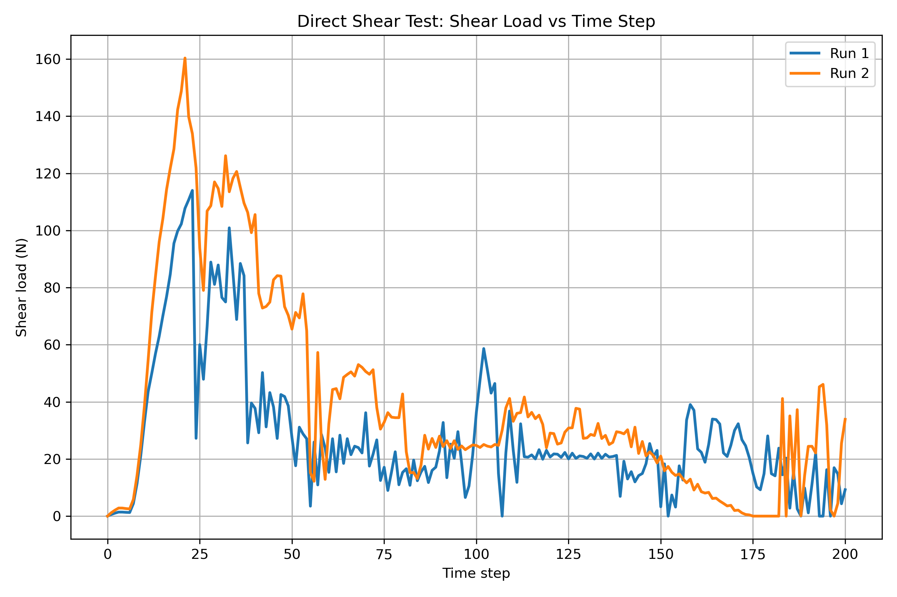

### Interpretation

This plot shows the same mechanical story as the displacement plot, but now as a function of time step.

In both runs:

- the shear load increases steadily during the early stage
- a peak load is reached
- post-peak behavior becomes noisy and fluctuating

The irregular post-peak response indicates that the discontinuity does not soften smoothly. Instead, shear resistance is controlled by a sequence of local failures, sliding events, and contact readjustments along the rough interface.

This confirms that the direct shear response is governed by discontinuity-scale mechanical instability rather than uniform sliding.

---

## 3. Equivalent shear load versus shear displacement

The file `direct_shear_equivalent_shear_load_vs_displacement.png` presents the equivalent shear load response for the two runs.

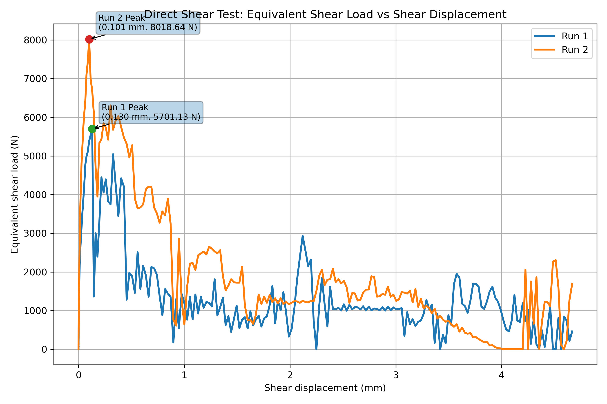

### Interpretation

This plot follows the same general trend as the direct shear-load plot, but in a scaled form.

- **Run 1** reaches a peak equivalent shear load of about **5701.13 N** at **0.130 mm**
- **Run 2** reaches a peak equivalent shear load of about **8018.64 N** at **0.101 mm**

Again, Run 2 shows the higher peak value. This is consistent with the conclusion that Run 2 mobilizes greater shear resistance than Run 1.

The post-peak oscillations indicate that equivalent shear resistance continues to vary strongly as the discontinuity surface degrades and local contact conditions evolve.

---

## 4. Instantaneous friction angle versus shear displacement

The file `direct_shear_friction_angle_vs_displacement.png` shows the evolution of instantaneous friction angle, computed from the simulated shear load and the applied normal load.

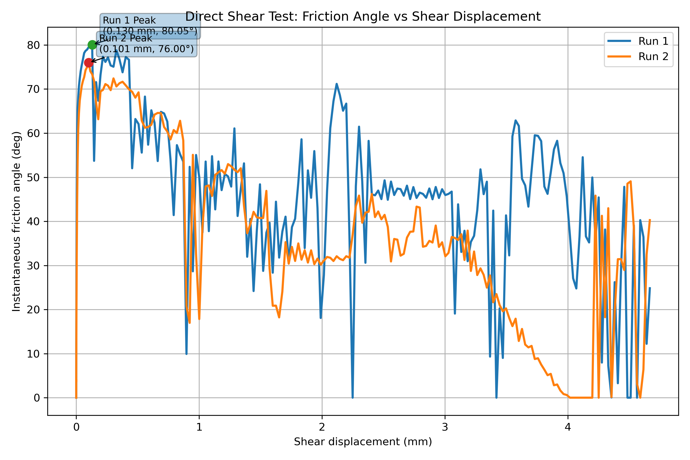

### Interpretation

The friction-angle response shows how the apparent resistance to sliding evolves during shearing.

- **Run 1** reaches a peak friction angle of about **80.05°**
- **Run 2** reaches a peak friction angle of about **76.00°**

Although Run 2 reaches the higher shear load, its peak friction angle is slightly lower. This is reasonable because friction angle depends not only on shear load but also on the normal load used in the calculation.

After the peak, both runs show strong fluctuations. This happens because the instantaneous friction angle is directly controlled by the unstable post-peak shear response. As asperities break, surfaces slip, and contact zones reorganize, the friction angle also varies irregularly.

This makes the friction-angle plot a useful indicator of the instability and evolving roughness-controlled behavior of the discontinuity.

---

## 5. Direct comparison of Run 1 and Run 2

The file `direct_shear_run1_vs_run2_comparison.png` provides a direct comparison of the main shear-load response.

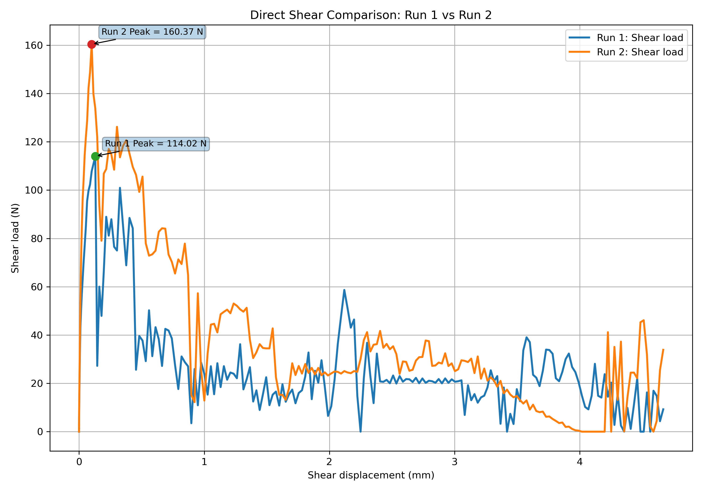

### Interpretation

This comparison clearly shows that:

- Run 2 mobilizes greater peak shear resistance than Run 1
- Run 2 reaches peak load slightly earlier
- both runs undergo post-peak softening and irregular residual behavior

The overall conclusion is that the second run is mechanically stronger in terms of peak resistance, but both runs ultimately exhibit unstable residual sliding controlled by asperity degradation and stress redistribution.

---

## 6. Minimum principal stress evolution: Run 1

The following images show the evolution of minimum principal stress for **Run 1** at selected simulation times.

### Run 1 at 2 million time steps

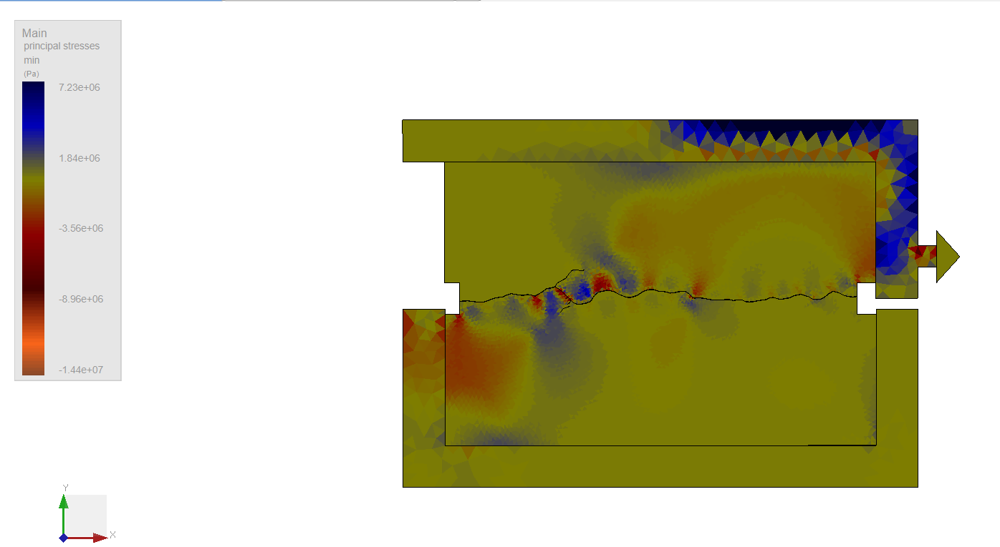

### Run 1 at 5 million time steps

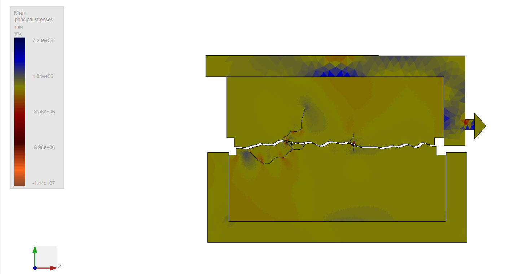

### Run 1 at 10 million time steps

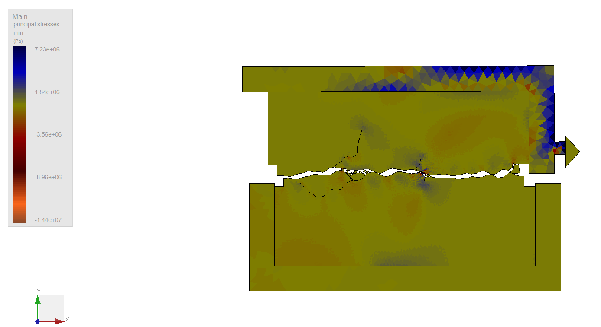

### Run 1 at 15 million time steps

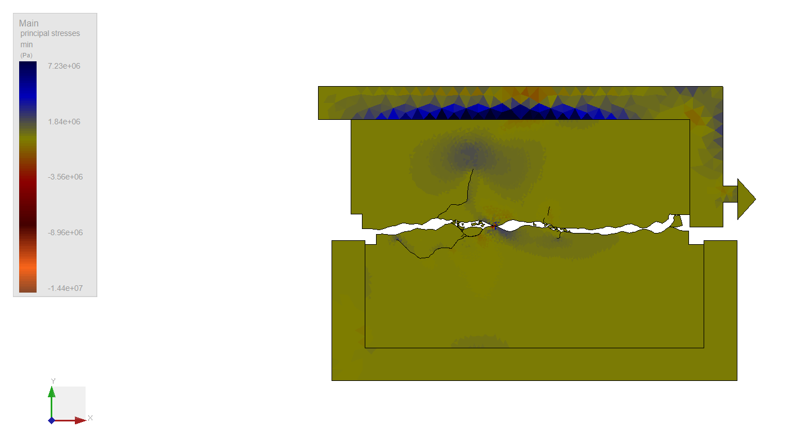

### Run 1 at 20 million time steps

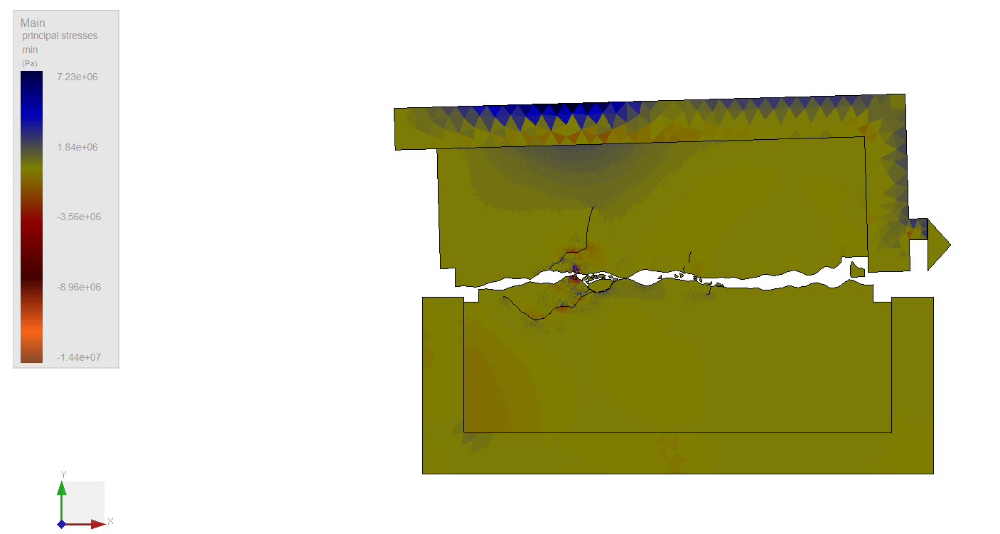

### Interpretation of Run 1 stress evolution

At the early stages, represented by the **2M** and **5M** images, the stress field is still relatively localized around a few active contact zones along the discontinuity. Load is carried through isolated asperity contacts, and only limited cracking is visible near the joint.

At intermediate stages, especially by **10M** and **15M** time steps, stress redistribution becomes more evident near the rough profile. Localized stress concentrations develop around the most active asperities, and crack development becomes more visible. This indicates that the interface is beginning to degrade and transfer load through changing contact locations.

By **20M** time steps, the stress field reflects a more degraded joint response. The contact pattern becomes more selective, and the remaining load is transferred through fewer dominant zones. This agrees with the fluctuating residual response seen in the shear-load plots, where the joint continues to resist sliding but in a reduced and unstable manner.

---

## 7. Minimum principal stress evolution: Run 2

The following images show the evolution of minimum principal stress for **Run 2** at selected simulation times.

### Run 2 at 2 million time steps

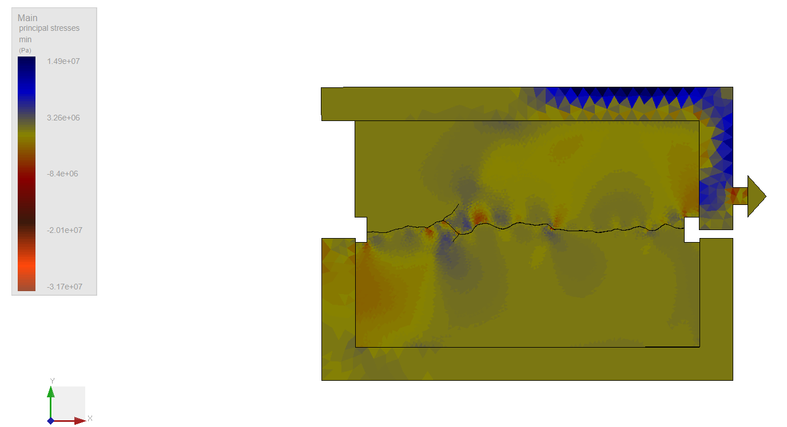

### Run 2 at 5 million time steps

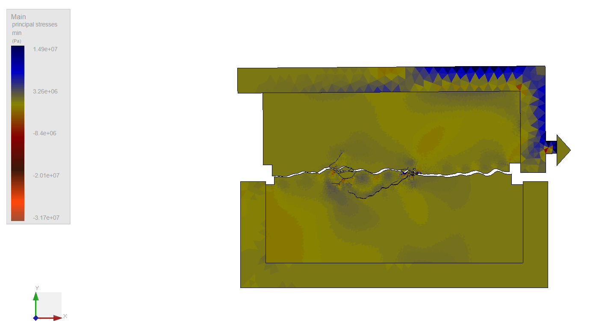

### Run 2 at 10 million time steps

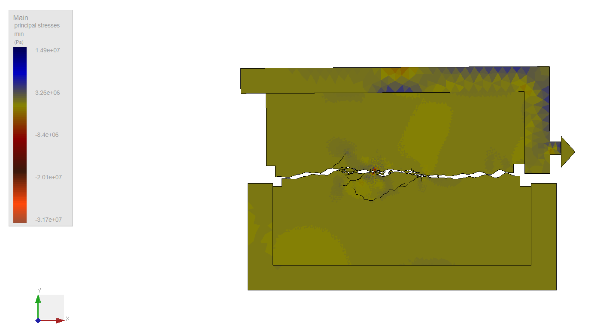

### Run 2 at 15 million time steps

### Run 2 at 20 million time steps

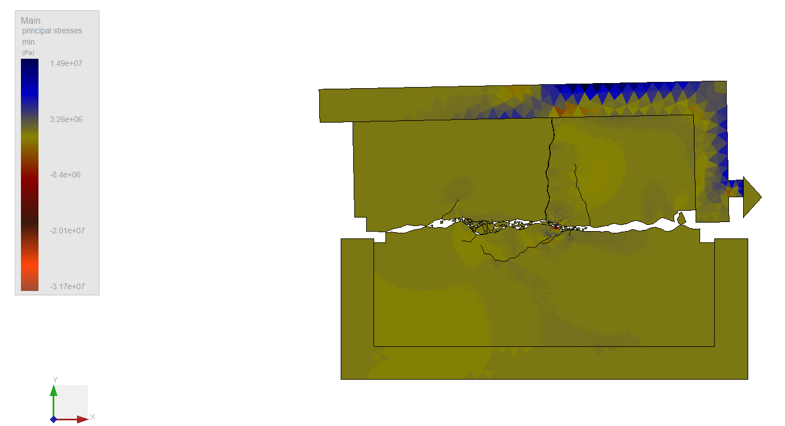

### Interpretation of Run 2 stress evolution

Run 2 shows the same broad pattern as Run 1, but with stronger stress mobilization and more pronounced local concentrations near the discontinuity.

At **2M** and **5M** time steps, the stress field is already strongly influenced by the roughness profile, and contact zones near the joint are more actively loaded.

At **10M** and **15M** time steps, the stress redistribution becomes more intense. High-stress concentration zones appear near major asperity contacts, and cracking near the interface becomes more developed. This is consistent with the higher peak resistance observed in Run 2, because greater resistance is typically associated with stronger asperity interaction before degradation progresses.

By **20M** time steps, the stress field indicates an evolved post-peak state in which shear transfer is maintained through a reduced number of active contact regions. The stress distribution is no longer uniform, and the mechanical response is governed by progressive damage, local crushing or debonding, and intermittent contact re-engagement.

---

## 8. Engineering significance

The direct shear results show that the rough discontinuity response is strongly controlled by asperity interaction.

The main engineering observations are:

- both runs exhibit a clear peak and post-peak shear-softening response
- Run 2 develops higher peak shear resistance than Run 1
- friction angle evolves dynamically and becomes unstable after peak load
- stress redistribution along the joint becomes increasingly localized as shearing progresses
- later-stage behavior is governed by progressive asperity damage and unstable residual sliding

These observations are important because they show that direct shear behavior is not defined by a single constant friction value. Instead, the resistance evolves continuously with displacement, contact degradation, crack growth, and stress redistribution.

---

## 9. Summary

The post-processing results support the following conclusions:

1. The direct shear test response shows clear pre-peak strengthening, peak resistance, and post-peak softening.
2. Run 2 achieves higher peak shear resistance than Run 1.
3. Run 1 reaches a peak shear load of about **114.02 N**, while Run 2 reaches about **160.37 N**.
4. Run 1 reaches a peak friction angle of about **80.05°**, while Run 2 reaches about **76.00°**.
5. The minimum principal stress snapshots show that stress transfer becomes more localized as shearing progresses.
6. The stress snapshots confirm progressive contact evolution, asperity damage, and redistribution of load along the discontinuity.
7. The naming of the snapshot files directly indicates the run number and the simulation time step level, where `2M`, `5M`, `10M`, `15M`, and `20M` represent 2 million, 5 million, 10 million, 15 million, and 20 million time steps respectively.

Overall, the direct shear simulation provides a useful numerical picture of how a rough rock discontinuity mobilizes resistance, reaches peak strength, and then progressively degrades under continued shearing.
