# Excavation of a Circular Tunnel in Irazu

## Overview

This project presents a 2D numerical simulation of circular tunnel excavation in a brittle geomaterial using Geomechanica Irazu. The study investigates how excavation-induced deformation and fracture development evolve under a fixed in-situ stress state, with particular focus on the contrast between a stronger material case and a reduced-strength material case.

Two excavation cases were analyzed under the same geometry, boundary conditions, excavation procedure, and far-field stresses. In **Case 1**, the material remained strong enough that the final response was smooth and no obvious fracture zone developed around the tunnel. In **Case 2**, reduced strength and fracture-energy parameters produced visible cracking, larger inward displacement, stronger tunnel closure, and a more persistent dynamic response.

The project combines:
- model setup comparison
- displacement-field snapshots at selected output steps
- node-based time-history extraction
- comparison plots for displacement, radial convergence, force magnitude, and velocity magnitude
- engineering interpretation of non-fracturing versus fracturing tunnel response

---

## Project objectives

This tunnel excavation case study was structured around the following objectives:

1. Describe the geometry, mesh concept, excavation setup, and in-situ stress conditions for a circular tunnel model in Irazu.
2. Compare two excavation cases under identical external loading and excavation logic but different material strength properties.
3. Examine how reducing cohesion, tensile strength, and fracture energies influences fracture development around the tunnel.
4. Visualize displacement-field evolution at selected output steps for both cases.
5. Extract and compare time-varying nodal responses near the tunnel using exported CSV data.
6. Interpret the mechanical differences between a stable excavation response and a fractured excavation response.

---

## Geometry and problem definition

The model is based on the circular tunnel excavation tutorial geometry.

| Item | Value |
|---|---:|
| Model type | 2D circular tunnel excavation |
| Domain size | 50 m × 50 m |
| Domain corner coordinates | (-25, 25), (25, 25), (-25, -25), (25, -25) |
| Tunnel outer radius | 1.5 m |
| Tunnel outer diameter | 3.0 m |
| Inner circular boundary radius | 1.3 m |
| Inner circular boundary diameter | 2.6 m |
| Implied liner thickness | 0.2 m |
| Tunnel location | Center of domain |
| Maximum principal stress direction | Horizontal |
| Minimum principal stress direction | Vertical |
| σXX | -2.5e+07 Pa |
| σYY | -2.0e+07 Pa |
| σXY | 0 Pa |
| Excavation method | Core modulus reduction |
| Lining in tutorial geometry | Present geometrically |
| Lining in this project | Not activated |

---

## Comparative parameter table

### Shared model settings

| Parameter | Case 1, Run 1 | Case 2, Run 3 |
|---|---:|---:|
| Model type | 2D circular tunnel excavation | 2D circular tunnel excavation |
| Cohesive fracture model (FDEM) | Enabled | Enabled |
| Finite element model | Elastic | Elastic |
| Constitutive law | Plane strain | Plane strain |
| Density | 2500 kg/m³ | 2500 kg/m³ |
| Damping type | Viscous: Factor | Viscous: Factor |
| Damping factor | 1 | 1 |
| Young’s modulus | 1e+10 Pa | 1e+10 Pa |
| Poisson’s ratio | 0.25 | 0.25 |
| Boundary condition | Exterior = Pin | Exterior = Pin |
| σXX | -2.5e+07 Pa | -2.5e+07 Pa |
| σYY | -2.0e+07 Pa | -2.0e+07 Pa |
| σXY | 0 Pa | 0 Pa |
| Excavation method | Core modulus reduction | Core modulus reduction |
| Excavation time | 100000 | 100000 |
| Lining | Off | Off |

### Material property comparison

| Property | Case 1 Rock / Core | Case 2 Rock / Core |
|---|---:|---:|
| Friction angle | 30.96° | 30.96° |
| Cohesion | 2.0e+07 Pa | 1.3e+07 Pa |
| Tensile strength | 5.0e+06 Pa | 3.0e+06 Pa |
| Mode I fracture energy | 20 N/m | 10 N/m |
| Mode II fracture energy | 150 N/m | 100 N/m |

### Penalty comparison

| Penalty | Case 1 Rock | Case 1 Core | Case 2 Rock | Case 2 Core |
|---|---:|---:|---:|---:|
| Fracture penalty | 1e+11 | 1e+11 | 1e+11 | 1e+11 |
| Normal penalty | 1e+11 | 1e+11 | 1e+11 | 1e+11 |
| Tangential penalty | 1.51228e+13 | 1.45199e+13 | 1.51228e+13 | 1.45199e+13 |

### Result comparison

| Output / behavior | Case 1, Run 1 | Case 2, Run 3 |
|---|---|---|
| Visible fracture around tunnel | No | Yes |
| Final response | Smooth excavation response | Fractured excavation response |
| Engineering interpretation | Material too strong for visible failure | Reduced strength enabled excavation-induced cracking |

---

## Excavation sequence

In both cases, excavation was simulated using core modulus reduction applied to the tunnel core. The reduction sequence was:

| Mechanical Time Step | Tunnel Core Young’s Modulus |
|---|---:|
| 1 | 1E+10 Pa |
| 25000 | 1E+10 Pa |
| 100000 | 1E+08 Pa |

This means both cases used the same excavation timing and modulus-reduction logic. The key difference between the two cases was therefore the material strength set, not the excavation procedure itself.

---

## Key result

The simulations show a clear transition from a non-fracturing excavation response to a fractured excavation response when material strength is reduced. Under the same geometry, boundary conditions, stress field, and excavation logic, **Case 1** develops only a smooth displacement redistribution around the tunnel, whereas **Case 2** develops visible cracks, larger inward closure, stronger displacement growth, and a more persistent dynamic response.

---

## Displacement-field evolution

The displacement screenshots below were saved at output timesteps **000, 010, 020, and 030**, corresponding respectively to **0, 100,000, 200,000, and 300,000 simulation time steps**.

### Case 1: displacement evolution

#### 1. Initial state, timestep 000
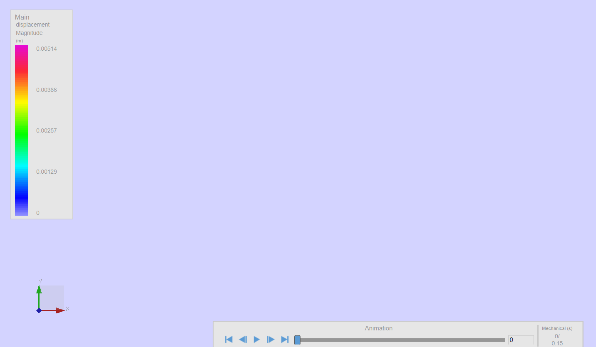

At the beginning of the simulation, the model remains undeformed and the displacement field is essentially zero everywhere.

#### 2. Timestep 010
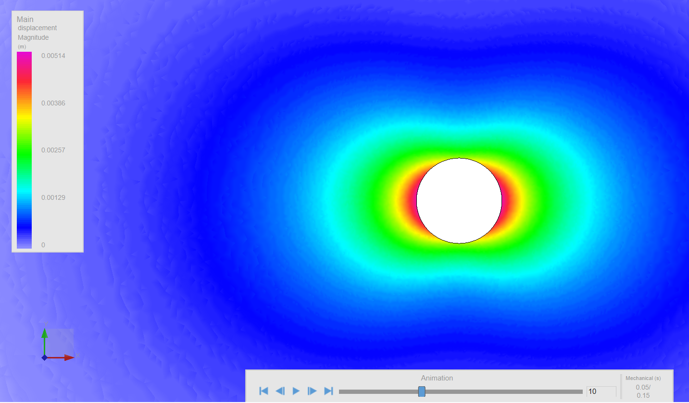

At this stage, the response is still weak. The tunnel region shows very limited disturbance, indicating that deformation has not yet grown significantly.

#### 3. Timestep 020
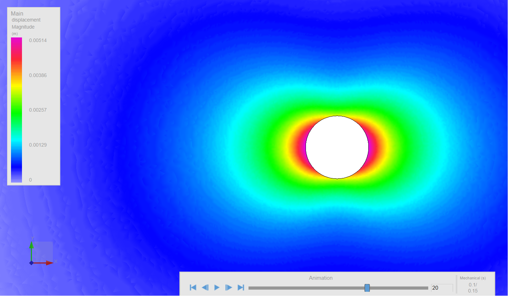

A smooth displacement halo develops around the tunnel. The response remains continuous and symmetric, with no obvious localized fracture band.

#### 4. Final state, timestep 030
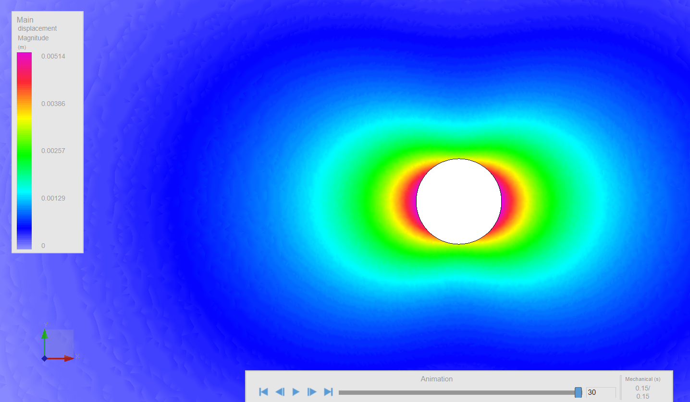

By the final output step, Case 1 shows a stable and smooth redistribution of displacement around the opening. The response is dominated by tunnel closure, but no clear fracture zone develops.

### Interpretation of Case 1

Case 1 behaves as a comparatively stable excavation case. The displacement field grows gradually and remains smooth throughout the simulation. The final response suggests elastic-dominant or weakly damaged redistribution rather than strong localized failure. This is consistent with the higher cohesion, higher tensile strength, and larger fracture-energy values assigned in this case.

---

### Case 2: displacement and fracture evolution

#### 1. Initial state, timestep 000
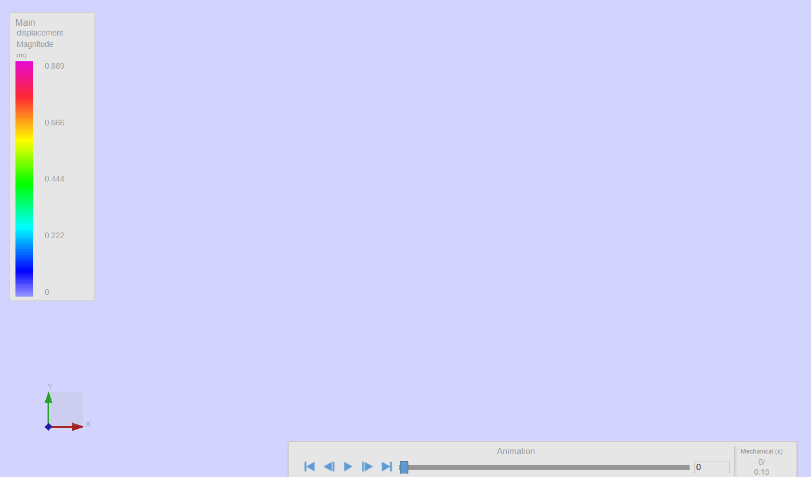

The initial state is undeformed, as expected, with no visible displacement concentration or cracking.

#### 2. Timestep 010
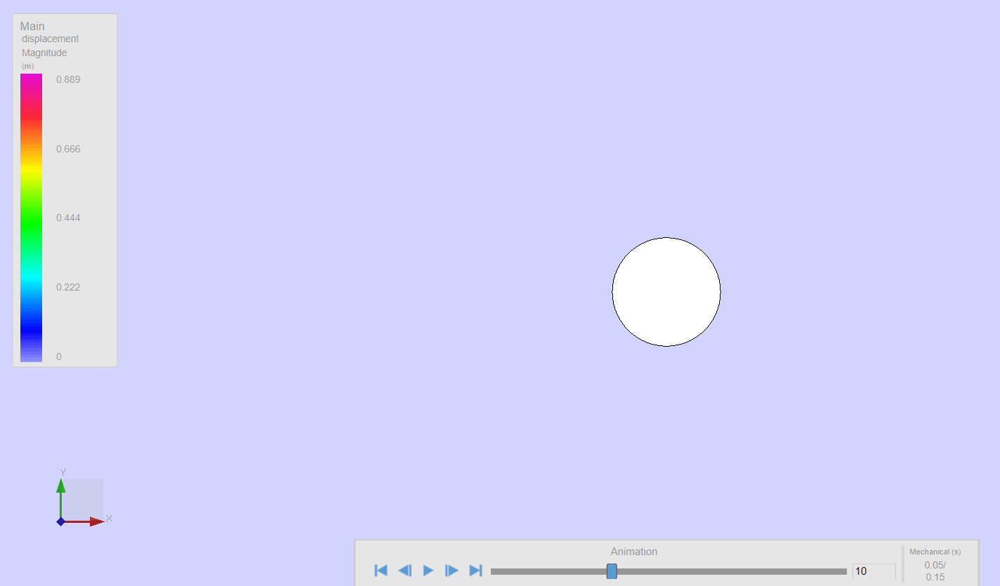

At this stage, the excavation response is still limited, although the system is beginning to depart from the purely undisturbed state.

#### 3. Timestep 020
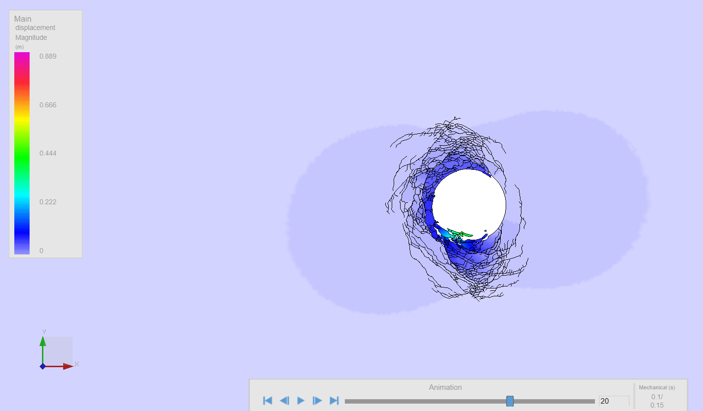

A visible fractured zone develops around the opening. Localized cracks emerge mainly around the tunnel perimeter, showing that the reduced-strength material is no longer able to sustain the same excavation-induced stress concentration without failure.

#### 4. Final state, timestep 030
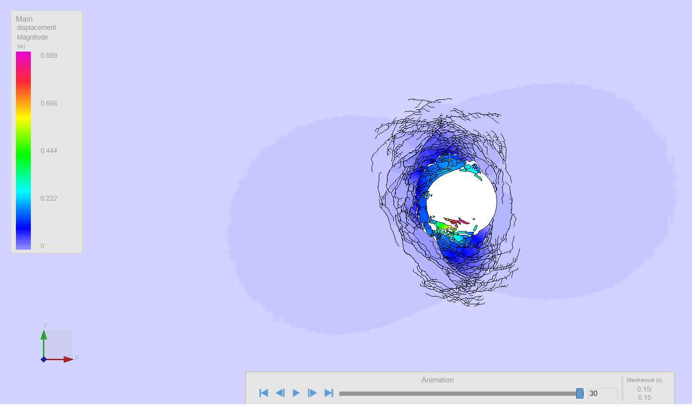

By the final output step, Case 2 exhibits a strongly fractured response with a clear localized damage zone surrounding the tunnel. Displacement is concentrated near the excavation boundary, and the response is much more irregular than in Case 1.

### Interpretation of Case 2

Case 2 shows a much more severe excavation response. The reduced cohesion, reduced tensile strength, and lower fracture energies allow the redistributed tunnel stresses to trigger visible fracture growth. The final pattern is no longer smooth and continuous but instead reflects progressive excavation-induced cracking and localized deformation around the opening.

---

## Node-based time-history analysis

To move beyond visual inspection, average time-varying data were exported from selected nodes near the tunnel region. The extracted quantities included:

- displacement magnitude
- displacement x
- displacement y
- displacement (polar) r
- displacement (polar) θ
- force magnitude
- velocity magnitude

These data were exported separately for Case 1 and Case 2 and then compared using Python.

---

## Results

### 1. Average displacement magnitude comparison
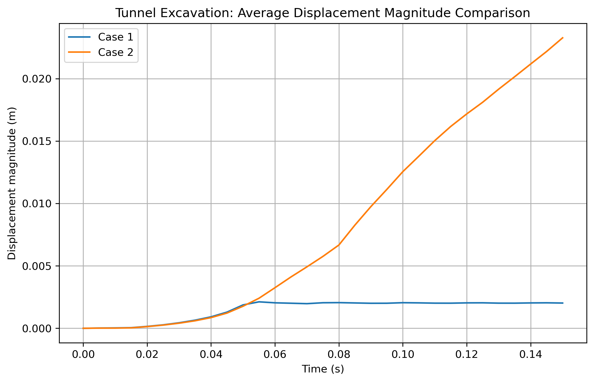

Case 1 rises to a small displacement level of about 0.002 m and then stabilizes. Case 2 continues increasing throughout the simulation and reaches about 0.023 m. This shows that the reduced-strength case experiences much larger progressive deformation than the stronger case.

### 2. Polar displacement comparison
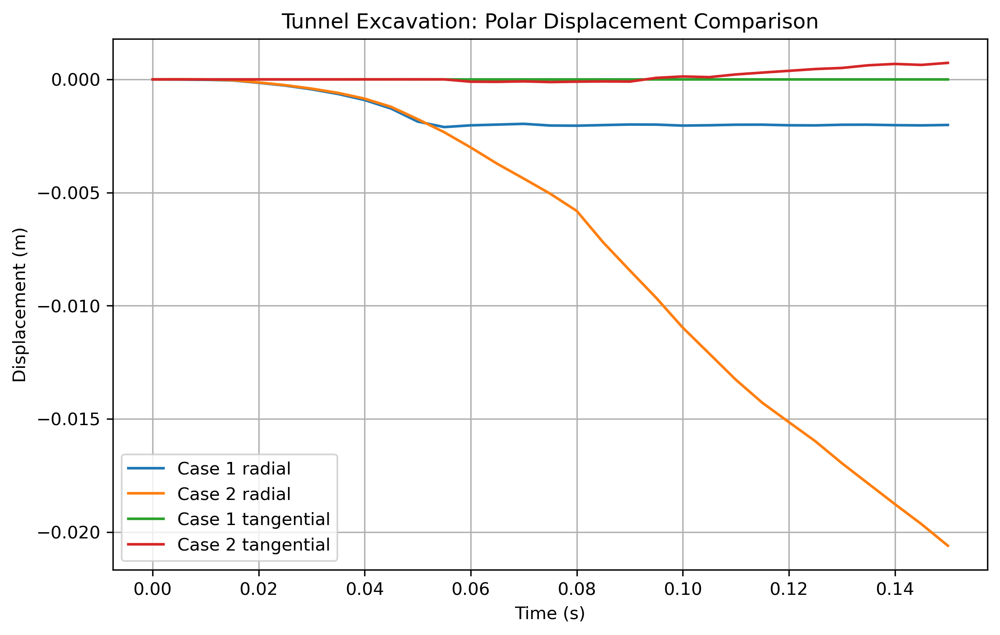

This is the most physically meaningful comparison for the tunnel problem. In both cases, the radial displacement becomes negative, indicating inward tunnel closure. However, the radial displacement in Case 2 becomes much more negative and reaches about -0.020 m, compared with only about -0.002 m in Case 1. Tangential displacement remains small in both cases, meaning the response is dominated by inward convergence rather than large circumferential motion.

### 3. Average velocity magnitude comparison
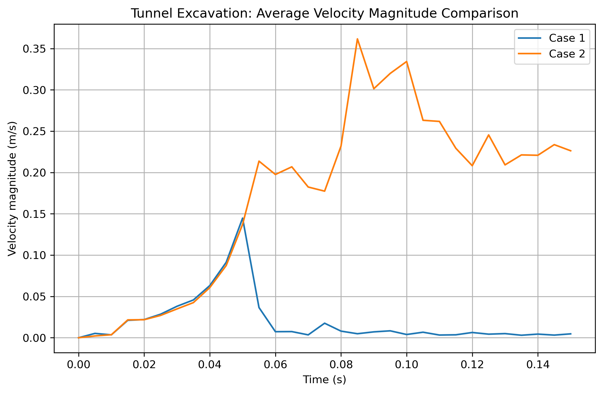

Case 1 shows an early transient peak and then rapidly decays to a very small level, indicating that its motion settles quickly. Case 2 reaches a higher peak and remains elevated for much longer, suggesting continued mechanical activity and progressive deformation near the excavation.

### 4. Average force magnitude comparison
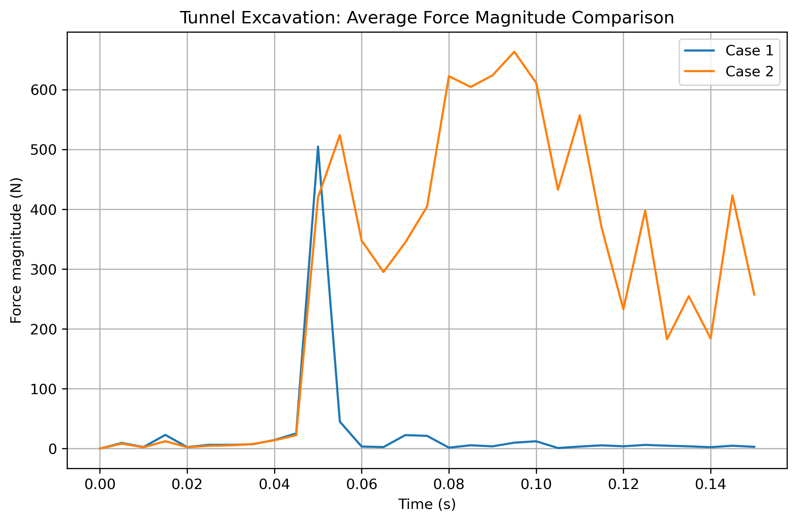

Case 1 develops a sharp transient force peak and then relaxes. In contrast, Case 2 sustains a much larger and more fluctuating force response, which is consistent with continued crack interaction, stress redistribution, and localized instability around the tunnel boundary.

### 5. Cartesian displacement comparison
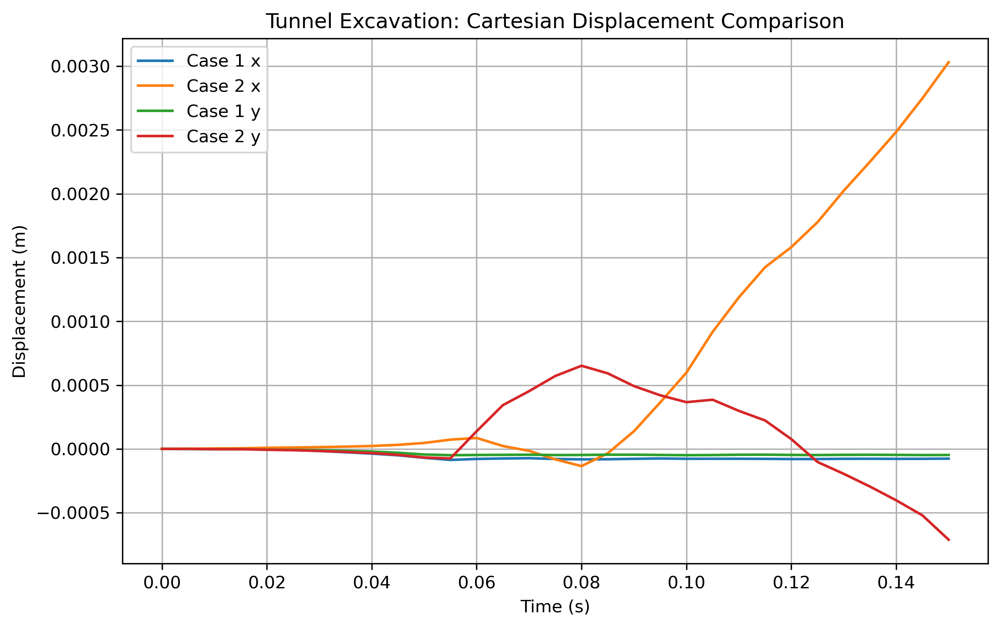

The Cartesian components confirm that Case 2 undergoes much more active net movement than Case 1. While the global x and y components are less intuitive than the polar components for tunnel interpretation, they still show that Case 2 experiences stronger directional deformation than the stronger, more stable Case 1.

---

## Engineering significance

This project highlights the sensitivity of excavation response to material strength parameters. Under identical excavation geometry, in-situ stresses, and excavation timing:

- **Case 1** remains comparatively stable and develops only a smooth displacement redistribution
- **Case 2** undergoes visible fracturing, larger tunnel closure, higher displacement growth, and a more persistent dynamic response

The results demonstrate that reducing cohesion, tensile strength, and fracture energies can move the system from a non-fracturing response into a fractured excavation regime. This makes the tunnel project a useful demonstration of how strength degradation influences excavation-induced damage and deformation in brittle geomaterials.

---

## Files included in this project

```text
03_tunnel_excavation_circular_opening/
├── data/
│   ├── case1_tunnel_node_selection_history.csv
│   ├── case2_tunnel_node_selection_history.csv
│   ├── tunnel_case1_case2_node_selection_comparison.csv
│   └── tunnel_case_comparison_summary.csv
├── figures/
│   ├── case1_tunnel_displacement_timestep_000.png
│   ├── case1_tunnel_displacement_timestep_010.png
│   ├── case1_tunnel_displacement_timestep_020.png
│   ├── case1_tunnel_displacement_timestep_030.png
│   ├── case2_tunnel_displacement_timestep_000.png
│   ├── case2_tunnel_displacement_timestep_010.png
│   ├── case2_tunnel_displacement_timestep_020.png
│   ├── case2_tunnel_displacement_timestep_030.png
│   ├── tunnel_case1_case2_displacement_magnitude_comparison.png
│   ├── tunnel_case1_case2_polar_displacement_comparison.png
│   ├── tunnel_case1_case2_velocity_magnitude_comparison.png
│   ├── tunnel_case1_case2_force_magnitude_comparison.png
│   └── tunnel_case1_case2_cartesian_displacement_comparison.png
├── notes/
├── report/
├── scripts/
└── README.md
