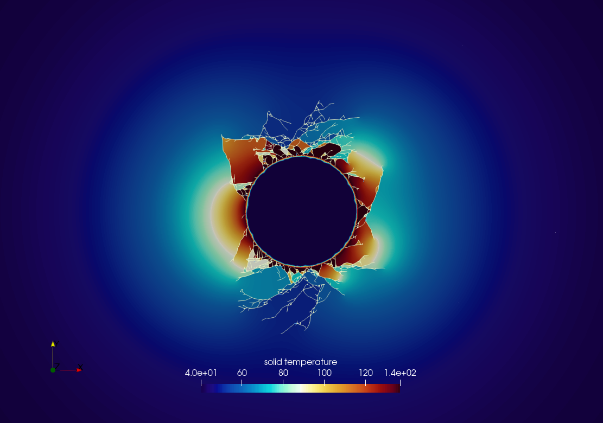
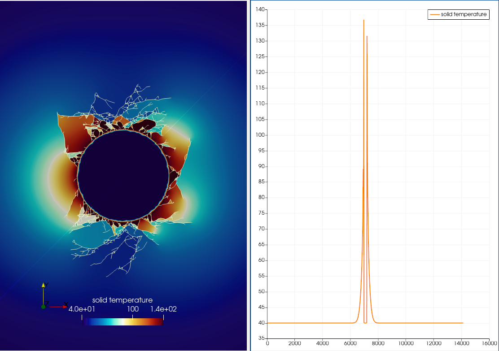
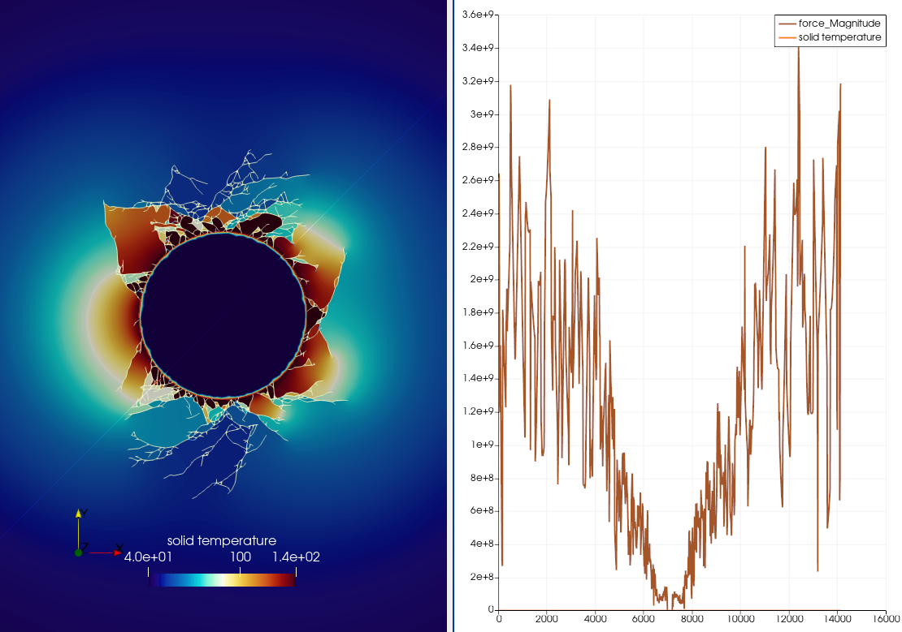
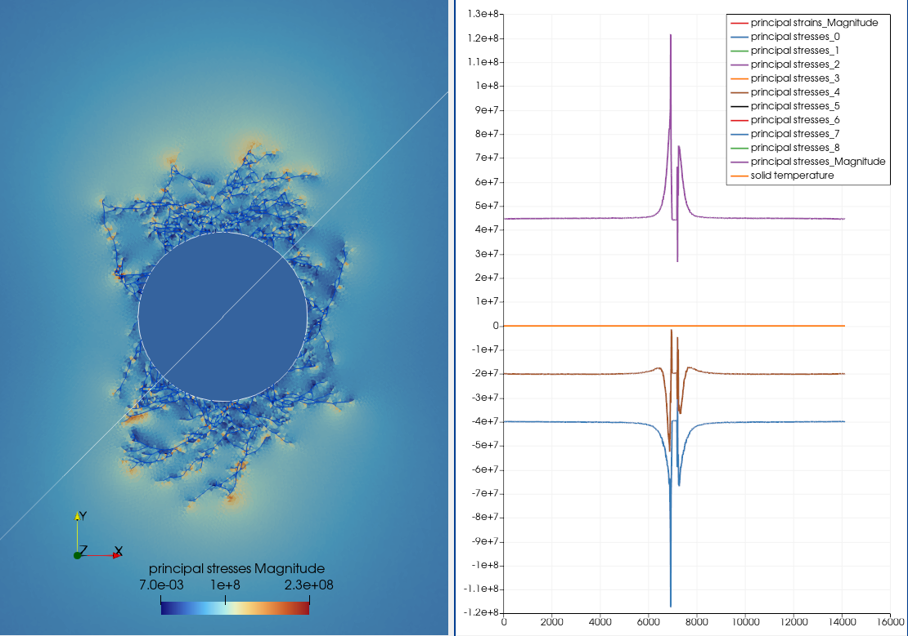
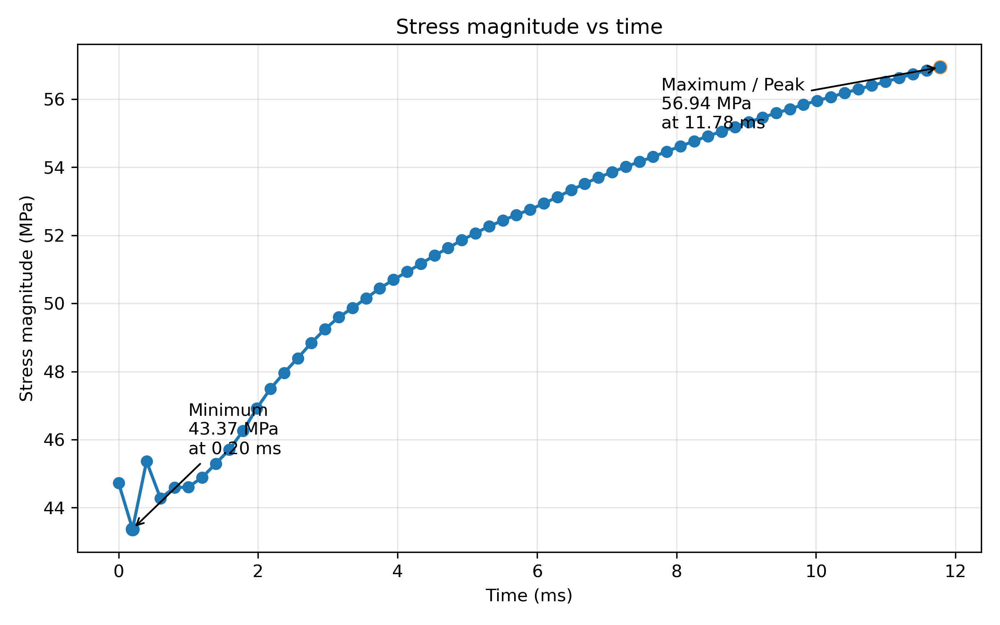
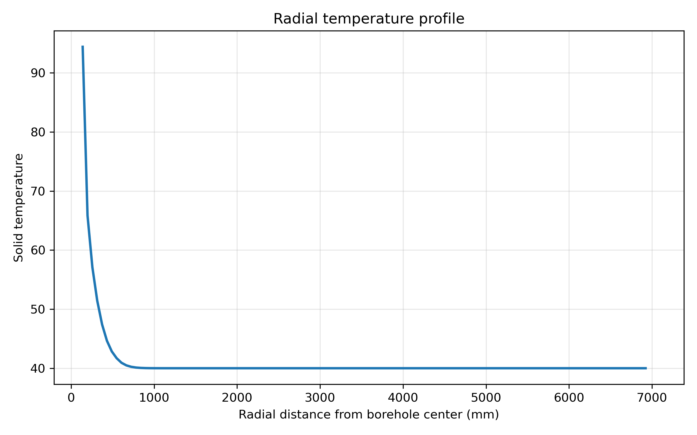
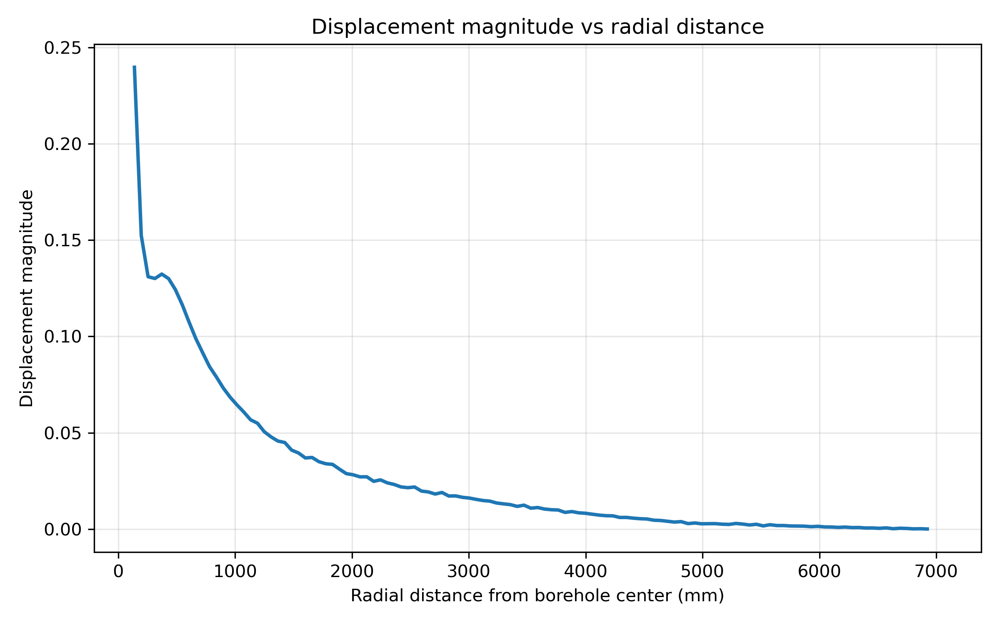
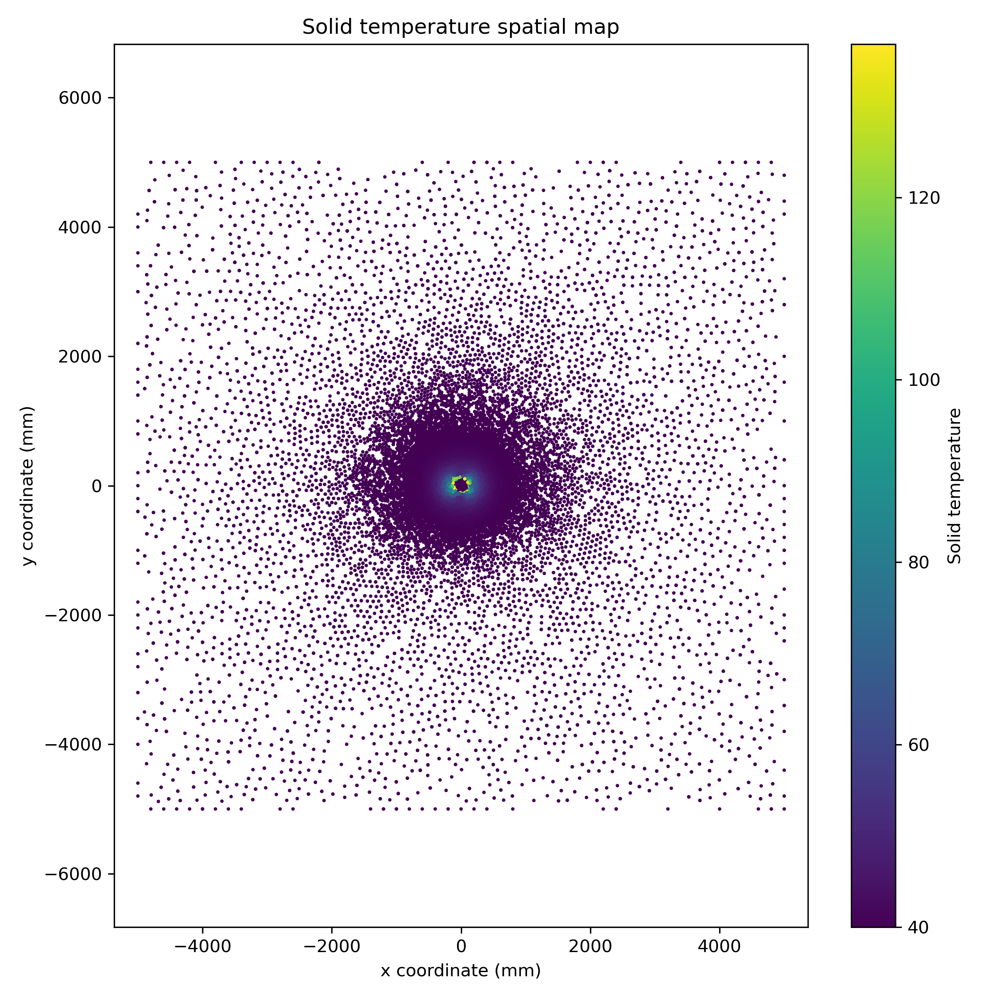

# Thermally Induced Borehole Breakout Simulation in Irazu

## Overview

This project presents a 2D thermo-mechanical numerical simulation of thermally induced borehole breakout using Geomechanica Irazu. The study investigates how heating of a borehole surface modifies the near-wellbore stress field and promotes breakout-type failure around the opening. The project combines Irazu modelling, ParaView post-processing, and Python-based quantitative plotting as part of a growing portfolio in computational rock mechanics and geomechanics.

## Project objectives

This case study was structured around the following objectives:

1. Simulate thermally induced borehole breakout under anisotropic in-situ stress conditions.
2. Visualize the final solid temperature field around the borehole.
3. Examine solid temperature and force behaviour along a selected diagonal profile.
4. Examine the principal stress field and its variation along the same diagonal profile.
5. Plot local stress magnitude over time from exported time-history data.
6. Plot radial temperature decay away from the borehole wall.
7. Plot displacement magnitude as a function of radial distance from the borehole center.
8. Generate a Python-based spatial temperature map to complement the ParaView field visualization.

## Model setup

### Problem definition

Borehole breakouts develop when stresses induced around the borehole exceed the compressive strength of the surrounding rock. In this project, the breakout is triggered by heating the borehole wall in a thermo-mechanically coupled model.

### Geometry and mesh

- Borehole diameter: 22 cm
- Borehole radius: 0.11 m
- Model domain: 10 m × 10 m
- Boundary location: 5 m from borehole center
- Circular refinement zone radius: 0.5 m
- Nominal element size in refinement zone: 5 mm

The model represents a horizontal cross section perpendicular to the axis of a vertical borehole.

### In-situ stresses and boundary conditions

- Maximum in-plane principal stress: 60 MPa
- Minimum in-plane principal stress: 30 MPa
- Outer boundary condition: fixed velocities along the external boundary
- Borehole surface pressure: applied after excavation to represent mud support

### Modelling sequence

The simulation was performed in stages:

1. In-situ stress initialization using an equilibrium FEM run
2. Gradual excavation of the borehole core by reducing Young’s modulus from step 5,000 to step 20,000
3. Removal of the core at step 20,000
4. Linear mud-pressure increase from 5 MPa to 37 MPa between steps 20,001 and 50,000
5. Thermo-mechanical coupling to simulate heating-induced stress redistribution and breakout development

### Rock input properties

| Property | Value |
|---|---:|
| Density | 2500 kg/m³ |
| Viscous damping factor | 1 |
| Young’s modulus | 60 GPa |
| Poisson’s ratio | 0.30 |
| Friction coefficient | 0.577 |
| Cohesion | 60 MPa |
| Tensile strength | 7 MPa |
| Mode I fracture energy | 20 N/m² |
| Mode II fracture energy | 200 N/m² |
| Specific heat capacity | 850 J/kg/°C |
| Thermal conductivity | 2.5 W/m/°C |
| Linear thermal expansion coefficient | 1e-3 1/°C |

## Key result

The simulation produced a strong localized thermal gradient around the borehole together with pronounced near-wellbore damage and stress redistribution, demonstrating how borehole heating can promote breakout-type failure in a thermo-mechanically coupled setting.

## Results

### 1. Final solid temperature field

The final temperature field shows intense heating concentrated around the borehole wall, followed by rapid thermal decay outward into the rock mass.

### 2. Solid temperature profile along a selected diagonal line

A diagonal profile through the model highlights a sharp thermal peak near the borehole wall and much lower temperatures in the far field.

### 3. Solid temperature and force profiles along the same diagonal line

This figure compares the thermal response and force magnitude along the same selected line. It helps relate the thermal peak near the borehole to the mechanical response of the surrounding medium.

### 4. Principal stress field and diagonal stress profile

The principal stress visualization shows how the borehole and thermal loading redistribute stress around the opening. The accompanying line profile highlights strong local stress perturbations near the borehole wall.

### 5. Stress magnitude vs time

The exported time-history data show a gradual increase in stress magnitude over the monitored interval. The minimum recorded stress magnitude was 43.37 MPa at 0.20 ms, while the maximum recorded value reached 56.94 MPa at 11.78 ms.

### 6. Radial temperature profile

The radial temperature profile shows a steep decrease in temperature away from the borehole wall, eventually approaching a far-field baseline.

### 7. Displacement magnitude vs radial distance

Displacement magnitude is largest near the borehole and decays steadily with radial distance, indicating that mechanical response is strongly concentrated in the near-wellbore region.

### 8. Python-generated solid temperature spatial map

This Python-generated spatial map provides an independent view of the temperature field and confirms the concentration of thermal loading near the borehole.

## Interpretation

This project illustrates a borehole-stability problem rather than a simple temperature-distribution exercise. Heating of the borehole surface creates a strong thermal gradient around the opening. Because the model is thermo-mechanically coupled, this temperature change alters the local stress field, amplifies near-wellbore mechanical response, and contributes to breakout-prone damage around the hole.

The ParaView field images clearly show that both temperature concentration and stress redistribution are localized around the borehole wall. The Python radial plots reinforce this interpretation by showing that temperature and displacement both decay outward from the borehole, meaning the dominant response is concentrated near the cavity. The stress time-history further shows that the monitored stress magnitude increased over the recorded interval, consistent with progressive local stress buildup during the simulated loading sequence.

Overall, the project demonstrates how thermal loading can interact with in-situ stress anisotropy and borehole support conditions to influence wellbore stability. This makes the case study especially relevant to geomechanics problems involving thermal wells, near-wellbore failure, and subsurface integrity.

## Files in this project

- `figures/` contains the ParaView screenshots and Python-generated plots
- `data/` contains the exported CSV datasets used for post-processing
- `scripts/` contains the Python script used to generate the quantitative plots
- `notes/` contains interpretation notes and any supporting observations
